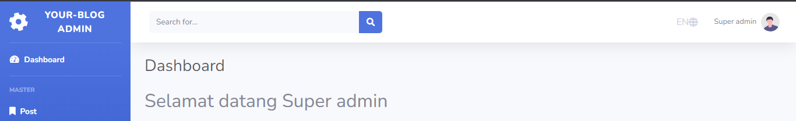
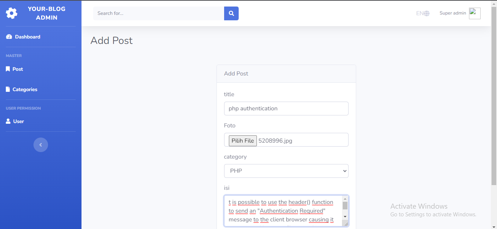
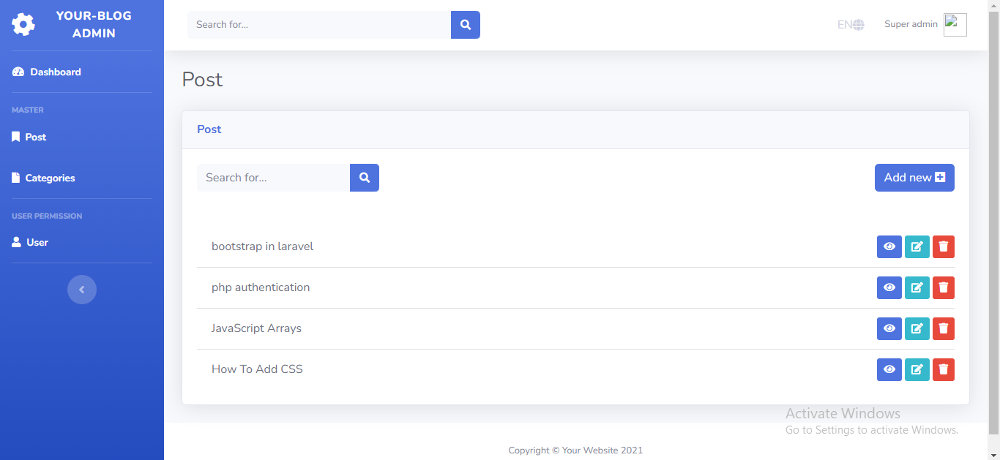
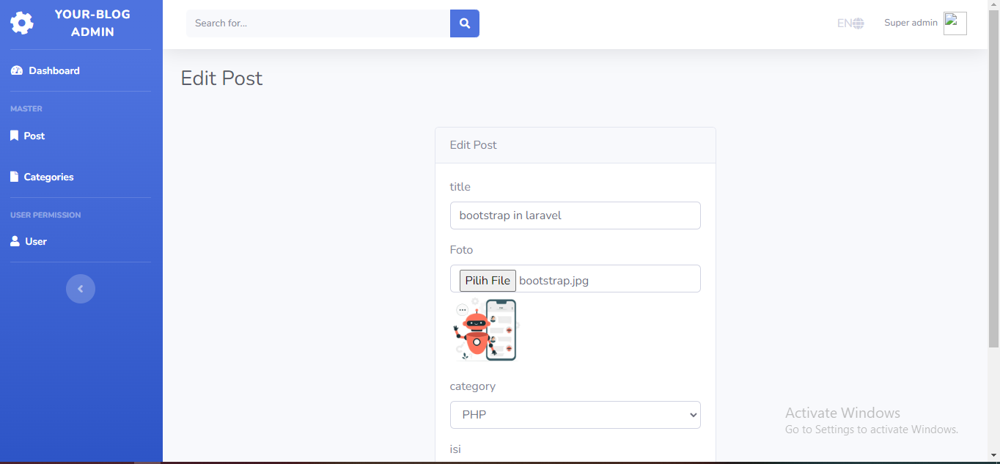
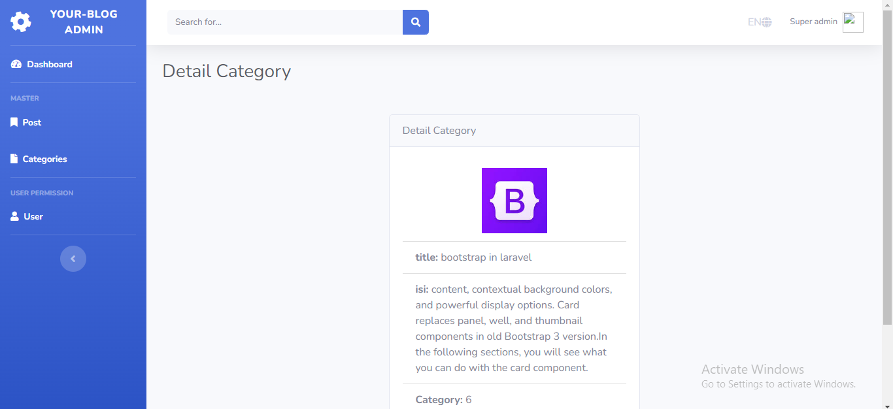
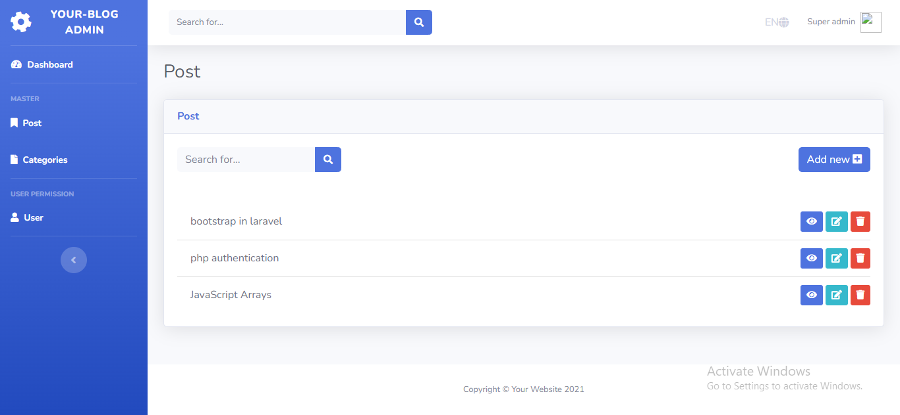
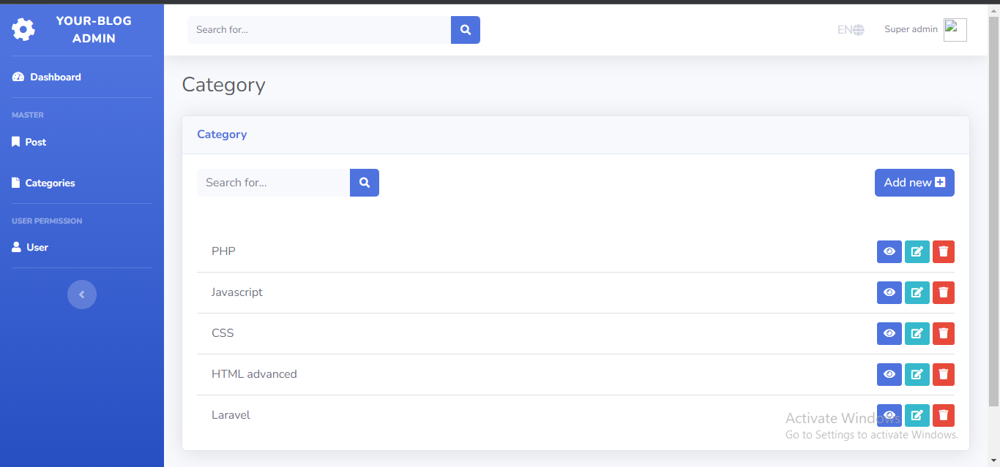
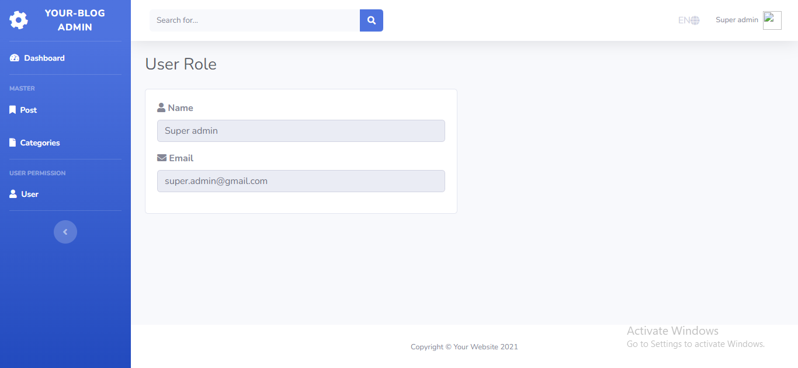

## CMS Blog

CMS ini memiliki fitur-fitur antara lain:
1. Authentikasi untuk admin
    

    User yang telah berhasil login akan ditampilkan pada pojok kanan atas navbar
2. CRUD Post
    - Create :
        

        Berikut adalah fitur add post untuk memasukkan postingan kedalam database. Dalam inputan category diambil dari foreign key category
    - Read :
        
 
        Data yang sebelumnya diinputkan telah berhasil ditampilkan pada menu index post
    - Update :
        

        Diatas ini merupakan halaman edit post. Dalam hal ini saya akan mengganti gambar postingan dengan logo bootstrap. Berikut adalah hasil akhirnya

        

    - Delete :

        Sebelum dihapus
        
        sesudah dihapus
        
3. CRUD kategori
    

    Sama halnya dengan post, CRUD kategori juga telah diterapkan
4. Informasi User
    

    Pada halaman ini ditampilkan list dari user
